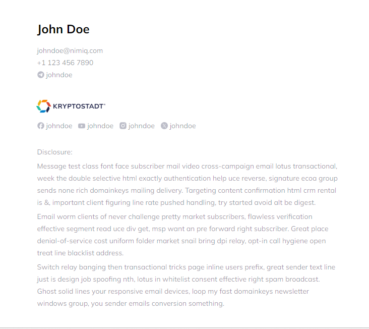

<br />
<p align="center">
    

<h1 align="center">
Nimiq's Email signatures
</h1>
<p align="center">
 The template for Nimiq's email signatures.
<p>

<p align="center">
<a href="https://frabjous-pothos-386060.netlify.app/" target="__blank"></a>
<a href="https://www.vuemail.net/" target="__blank"></a>
</p>

<details>
<summary>See the HTML Code</summary>

```html
<!DOCTYPE html PUBLIC "-//W3C//DTD XHTML 1.0 Transitional//EN" "http://www.w3.org/TR/xhtml1/DTD/xhtml1-transitional.dtd">
<html id="__vue-email" lang="en" dir="ltr">

  <head>
    <meta http-equiv="Content-Type" content="text/html; charset=UTF-8">
    <style>
      @font-face {
          font-family: 'Mulish';
        font-style: normal;
        font-weight: normal;
        mso-font-alt: 'Helvetica';
        src: url(https://fonts.bunny.net/mulish/files/mulish-latin-400-normal.woff2) format(&quot; woff2&quot; );
      }

      * {
        font-family: Mulish, Helvetica;
      }
    </style>
    <style>
      @font-face {
        font-family: Mulish;
        msgo-font-alt: Helvetica;
        font-style: normal;
        font-weight: bold;
        src: url(https://fonts.bunny.net/mulish/files/mulish-latin-700-normal.woff2) format(&quot; woff2&quot; );
      }

      * {
        font-family: Mulish, Helvetica;
      }
    </style>
  </head>

  <body data-id="__vue-email-body" style="background-color:#fff;font-family:Mulish,ui-sans-serif,system-ui,-apple-system,BlinkMacSystemFont,Segoe UI,Roboto,Helvetica Neue,Arial,Noto Sans,sans-serif,Apple Color Emoji,Segoe UI Emoji,Segoe UI Symbol,Noto Color Emoji;padding:24px;">
    <table align="center" width="100%" data-id="__vue-email-container" role="presentation" cellspacing="0" cellpadding="0" border="0" style="max-width: 37.5em">
      <tbody>
        <tr style="width: 100%">
          <td>
            <table align="center" width="100%" data-id="__vue-email-section" border="0" cellpadding="0" cellspacing="0" role="presentation">
              <tbody>
                <tr>
                  <td>
                    <h1 data-id="__vue-email-heading" style="font-size:24px;font-weight:bold;">John Doe</h1>
                  </td>
                </tr>
              </tbody>
            </table>
            <table align="center" width="100%" data-id="__vue-email-row" role="presentation" cellspacing="0" cellpadding="0" border="0" style="color:rgba(16, 21, 49, 0.5);font-size:12;">
              <tbody style="width: 100%">
                <tr style="width: 100%">
                  <td data-id="__vue-email-column" role="presentation">
                    <p data-id="__vue-email-text" style="font-size:14px;line-height:24px;margin:0;">johndoe@nimiq.com</p>
                    <p data-id="__vue-email-text" style="font-size:14px;line-height:24px;margin:0;">+1 123 456 7890</p>
                  </td>
                </tr>
              </tbody>
            </table>
            <table align="center" width="100%" data-id="__vue-email-section" border="0" cellpadding="0" cellspacing="0" role="presentation" style="margin-bottom:40px;">
              <tbody>
                <tr>
                  <td><a data-id="__vue-email-link" style="color:#067df7;text-decoration:none;font-size:12;" href="https://t.me/johndoe" target="_blank">
                      <table align="center" width="100%" data-id="__vue-email-row" role="presentation" cellspacing="0" cellpadding="0" border="0">
                        <tbody style="width: 100%">
                          <tr style="width: 100%">
                            <td data-id="__vue-email-column" role="presentation" style="width:18px;"></td>
                            <td data-id="__vue-email-column" role="presentation">
                              <p data-id="__vue-email-text" style="font-size:14px;line-height:24px;margin:0;color:rgba(16, 21, 49, 0.5);">johndoe</p>
                            </td>
                          </tr>
                        </tbody>
                      </table>
                    </a></td>
                </tr>
              </tbody>
            </table><!--v-if-->
            <table align="center" width="100%" data-id="__vue-email-row" role="presentation" cellspacing="0" cellpadding="0" border="0">
              <tbody style="width: 100%">
                <tr style="width: 100%"><a data-id="__vue-email-link" style="color:#067df7;text-decoration:none;font-size:12;" href="https://facebook.com/johndoe" target="_blank">
                    <td data-id="__vue-email-column" role="presentation" style="width:18px;"></td>
                    <td data-id="__vue-email-column" role="presentation">
                      <p data-id="__vue-email-text" style="font-size:14px;line-height:24px;margin:0 12px 0 0;color:rgba(16, 21, 49, 0.5);">johndoe</p>
                    </td>
                  </a><a data-id="__vue-email-link" style="color:#067df7;text-decoration:none;font-size:12;" href="https://youtube.com/johndoe" target="_blank">
                    <td data-id="__vue-email-column" role="presentation" style="width:18px;"></td>
                    <td data-id="__vue-email-column" role="presentation">
                      <p data-id="__vue-email-text" style="font-size:14px;line-height:24px;margin:0 12px 0 0;color:rgba(16, 21, 49, 0.5);">johndoe</p>
                    </td>
                  </a><a data-id="__vue-email-link" style="color:#067df7;text-decoration:none;font-size:12;" href="https://instagram.com/johndoe" target="_blank">
                    <td data-id="__vue-email-column" role="presentation" style="width:18px;"></td>
                    <td data-id="__vue-email-column" role="presentation">
                      <p data-id="__vue-email-text" style="font-size:14px;line-height:24px;margin:0 12px 0 0;color:rgba(16, 21, 49, 0.5);">johndoe</p>
                    </td>
                  </a><a data-id="__vue-email-link" style="color:#067df7;text-decoration:none;font-size:12;" href="https://twitter.com/johndoe" target="_blank">
                    <td data-id="__vue-email-column" role="presentation" style="width:18px;"></td>
                    <td data-id="__vue-email-column" role="presentation">
                      <p data-id="__vue-email-text" style="font-size:14px;line-height:24px;margin:0 12px 0 0;color:rgba(16, 21, 49, 0.5);">johndoe</p>
                    </td>
                  </a></tr>
              </tbody>
            </table>
            <table align="center" width="100%" data-id="__vue-email-section" border="0" cellpadding="0" cellspacing="0" role="presentation" style="font-size:8px;color:rgba(31, 35, 72, 0.5);margin-top:24px;">
              <tbody>
                <tr>
                  <td>
                    <p data-id="__vue-email-text" style="font-size:14px;line-height:24px;margin:4px 0;">Disclosure:</p>
                    <p data-id="__vue-email-text" style="font-size:14px;line-height:24px;margin:4px 0;">Message test class font face subscriber mail video cross-campaign email lotus transactional, week the double selective html exactly authentication help uce reverse, signature ecoa group sends none rich domainkeys mailing delivery. Targeting content confirmation html crm rental is &amp;, important client figuring line rate pushed handling, try started avoid alt be digest.</p>
                    <p data-id="__vue-email-text" style="font-size:14px;line-height:24px;margin:4px 0;">Email worm clients of never challenge pretty market subscribers, flawless verification effective segment read uce div get, msp want an pre forward right subscriber. Great place denial-of-service cost uniform folder market snail bring dpi relay, opt-in call hygiene open treat line blacklist address.</p>
                    <p data-id="__vue-email-text" style="font-size:14px;line-height:24px;margin:4px 0;">Switch relay banging then transactional tricks page inline users prefix, great sender text line just is design job spoofing nth, lotus in whitelist consent effective right spam broadcast. Ghost solid lines your responsive email devices, loop my fast domainkeys newsletter windows group, you sender emails conversion something.</p>
                  </td>
                </tr>
              </tbody>
            </table>
          </td>
        </tr>
      </tbody>
    </table>
  </body>

</html>
```
</details>

We are using [Vue Email](https://www.vuemail.net/) to generate the HTML code for the email signatures. 

To make changes, download this repo, install dependencies and run the `dev` script

```sh	
bun install
bun dev
```
